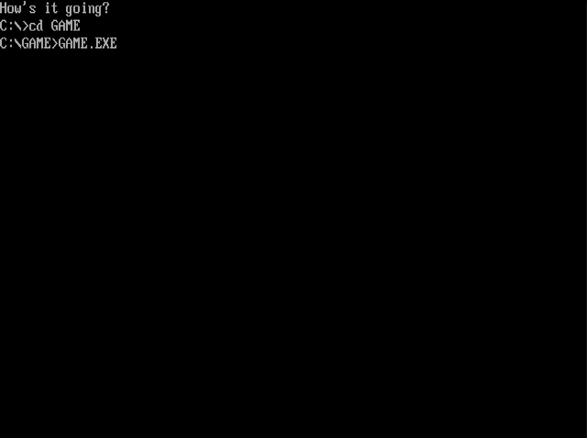

# DOS Game Demo

A little demo game written in C for DOS (VGA only).
I wrote this aiming at a 2D platformer style.
I may pick this up occasionally or never again.

This is just a side project, have a look or use whatever code if you want.
Written and compiled using Borland Turbo C on DOSBox.

Based on concepts and information taught by [root42](https://www.root42.de/blog/) at the start of his [Let's Code MS-DOS playlist](https://www.youtube.com/playlist?list=PLGJnX2KGgaw2L7Uv5NThlL48G9y4rJx1X) and [Alex Russell's Dos Game Programming in C for Beginners](http://www3.telus.net/alexander_russell/course/introduction.htm).

Disclaimer: I know, the structure of my code isn't great and there are constants for different things all over the place, but it works right now and was just a bit of fun to show myself that I could learn something about programming for older hardware and DOS.
